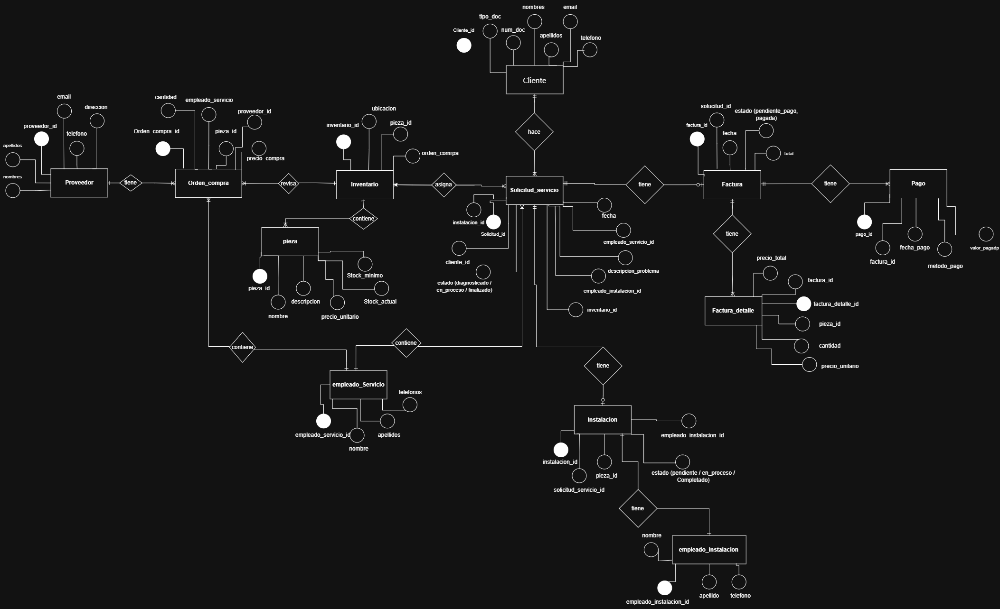
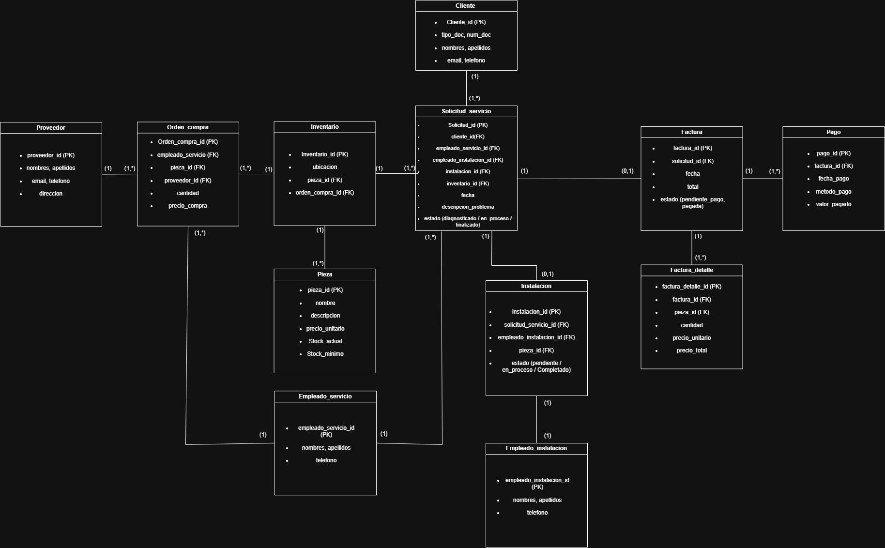
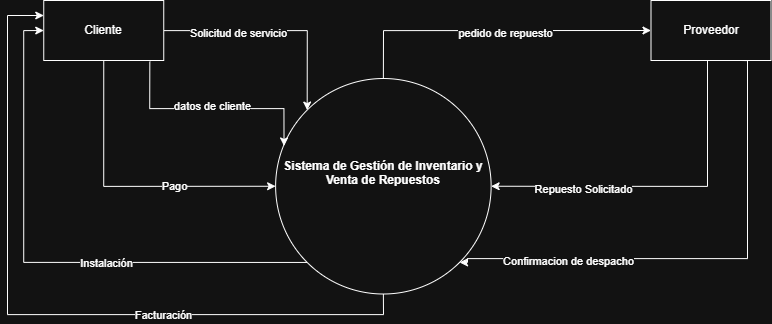

# 📄 Informe Técnico del Taller

## 🔖 Nombre del Taller
_Taller 2 - Modelo de Información y Diagrama de Contexto

## 👥 Integrantes del equipo
- Darek Aljuri (darekalma)
- Valentina Ruiz (valeruizto)
- Santiago Soler (san1tago)

## 🧠 Descripción general del trabajo
El objetivo del Taller 2 fue modelar la estructura de información y el contexto operativo del caso base "Clínica Salud Viva", mediante la elaboración de un Modelo Entidad-Relación (ERD) y un Diagrama de Contexto de Negocio. El propósito fue identificar las entidades principales del dominio clínico, sus relaciones y los flujos de información entre actores y sistemas, asegurando coherencia con los procesos administrativos y clínicos descritos.

La actividad se desarrolló inicialmente analizando el caso base, identificando las entidades nucleares (Paciente, Cita, Médico, Especialidad y Factura) y las interacciones entre actores (paciente, médico, asistente, aseguradora) y sistemas (agendamiento, ERP, base de datos y notificaciones). Posteriormente, se estructuró el modelo conceptual y se organizaron los flujos de información con enfoque en claridad, trazabilidad y alineación con buenas prácticas de modelado.

---
## 🔧 Proceso de desarrollo
El desarrollo del modelo se realizó siguiendo una metodología estructurada basada en el análisis de procesos y posterior modelado de datos.

En primer lugar, se identificó el problema principal de la empresa: la ausencia de un sistema formal para el control de inventario. Actualmente, el inventario se gestiona de manera visual, revisando físicamente la bodega, lo que genera riesgos como desabastecimiento, sobrecompra y falta de trazabilidad.

Posteriormente, se modeló el proceso actual mediante un diagrama BPMN, lo cual permitió identificar:

- Actores involucrados (cliente, empleado, proveedor).
- Eventos clave (solicitud de pieza, compra, recepción, facturación).
- Puntos de decisión (existencia o no de repuesto en inventario).

Una vez definido el flujo del proceso, se procedió a transformar los elementos persistentes del BPMN en entidades del modelo entidad-relación (ERD). Para ello, se aplicaron los siguientes criterios:

1. Los actores que requieren almacenamiento de información se modelaron como entidades (Cliente, Empleado, Proveedor).
2. Los eventos que generan registros históricos se modelaron como entidades (Orden_compra, Factura, Recepcion_piezas, Pago).
3. Las relaciones de tipo uno-a-muchos fueron resueltas mediante tablas intermedias (Orden_compra_detalle, Factura_detalle).
4. Se decidió integrar el control de stock dentro de la entidad Pieza, evitando crear una entidad Inventario independiente, dado que el alcance actual no contempla múltiples bodegas ni trazabilidad avanzada.
   
## 🧩 Análisis del modelo propuesto

### Cómo se estructura el modelo entregado

Cliente, Empleado, Pieza, Solicitud_servicio, Proveedor, Orden_compra, Orden_compra_detalle, Recepcion_piezas, Factura, Factura_detalle, Pago

* Gestión de servicios

Cliente → Solicitud_servicio → Factura → Pago

* Gestión de compras a proveedor

Proveedor → Orden_compra → Orden_compra_detalle → Recepcion_piezas

* Gestión de inventario

Pieza (incluye stock_actual y stock_minimo)

### Cómo representa las necesidades del cliente

El modelo responde directamente al Problema de que la empresa no cuenta con un registro formal de inventario.

La entidad Pieza incorpora atributos como:

- stock_actual y stock_minimo

Esto permite:

- Conocer en tiempo real la cantidad disponible de cada repuesto.
- Generar alertas cuando el stock llegue a un nivel mínimo.
- Evitar la revisión manual de la bodega.
- Vincular automáticamente el inventario con el proceso de compra y facturación.

Además, al integrar Orden_compra y Recepcion_piezas, el sistema permite:

- Registrar cuándo se solicita un repuesto.
- Registrar cuándo se recibe.
- Actualizar el stock de forma estructurada.

De esta manera, el modelo transforma un control empírico en un control sistemático y trazable.

### Qué supuestos se tomaron
  
Para delimitar el alcance del modelo se asumieron los siguientes supuestos:
1. La empresa cuenta con una sola bodega física.
2. Cada solicitud de servicio genera una única factura.
3. Una orden de compra puede incluir múltiples piezas.
4. Las recepciones pueden asociarse a una orden de compra.
5. No se modeló trazabilidad histórica de movimientos de inventario, únicamente el stock actual.
6. No se abordó el sistema de agendamiento (Problema #2), ya que el enfoque del proyecto es el control de inventario.

## 📈 Diagrama final entregado

Diagrama Contexto Final

## 📋 Tabla de actores, entidades o componentes (si aplica)
| Nombre del elemento  | Tipo    | Descripción                                                                     | Responsable     |
| -------------------- | ------- | ------------------------------------------------------------------------------- | --------------- |
| Cliente              | Actor   | Persona que solicita el servicio mecánico y realiza el pago                     | Cliente         |
| Empleado             | Actor   | Trabajador del taller que gestiona solicitudes, órdenes de compra y facturación | Taller/empresa |
| Proveedor            | Actor   | Empresa o persona que suministra las piezas al taller                           | Proveedor       |
| Solicitud_servicio   | Entidad | Registro del diagnóstico o servicio solicitado por el cliente                   | Empleado        |
| Pieza                | Entidad | Producto o repuesto utilizado en reparaciones o vendido al cliente              | Taller/empresa |
| Orden_compra         | Entidad | Documento que registra la solicitud de piezas al proveedor                      | Empleado        |
| Orden_compra_detalle | Entidad | Detalle de las piezas incluidas en una orden de compra                          | Empleado        |
| Recepcion_piezas     | Entidad | Registro de la recepción de piezas solicitadas al proveedor                     | Empleado        |
| Factura              | Entidad | Documento que registra el cobro del servicio y piezas al cliente                | Empleado        |
| Factura_detalle      | Entidad | Detalle de las piezas o servicios incluidos en la factura                       | Empleado        |
| Pago                 | Entidad | Registro del pago realizado por el cliente                                      | Cliente         |

## 🔍 Investigación complementaria
### Tema investigado:
Modelo Entidad-Relación en la industria y Diagramas de Contexto bajo el enfoque C4.

### Resumen:

Se investigaron las buenas prácticas en el uso de BPMN, estándar definido por el Object Management Group (OMG), el cual establece lineamientos para modelar procesos de negocio de manera clara y estructurada. Entre las principales recomendaciones se encuentran mantener un nivel adecuado de detalle, diferenciar correctamente los actores mediante pools y lanes, y representar claramente los puntos de decisión. Estas prácticas permiten que los diagramas sean comprensibles tanto para usuarios del negocio como para desarrolladores.

También se revisaron principios de normalización en modelos Entidad-Relación, basados en los estudios de Edgar F. Codd. La Tercera Forma Normal (3FN) busca reducir redundancias y garantizar integridad en la base de datos. Esto se aplicó en el taller mediante la creación de tablas detalle para representar relaciones uno-a-muchos, asegurando un modelo coherente y estructurado.

En el sector salud, estándares como HL7 FHIR demuestran cómo entidades como "Appointment" (Cita) deben estructurarse para permitir interoperabilidad entre plataformas clínicas y aseguradoras. Esto evidencia la importancia de un modelo conceptual sólido que pueda escalar hacia integraciones reales.

---

## 📚 Referencias
- [1] Object Management Group (2011). Business Process Model and Notation (BPMN) 2.0.
- [2] Codd, E. F. (1970). A Relational Model of Data for Large Shared Data Banks.

---

_Este documento hace parte de la entrega del taller X del curso AREM (Arquitectura Empresarial) - Universidad de La Sabana._
