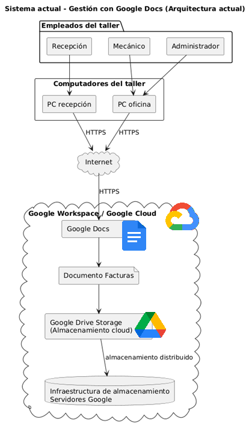
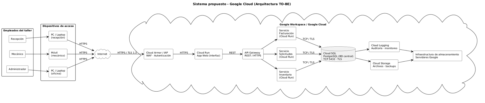

# 📄 Informe Técnico del Taller

## 🔖 Nombre del Taller
_Taller 4 - Taller infraestructura_

## 👥 Integrantes del equipo
- Valentina Ruiz
- Darek Aljuri
- Santiago Soler

## 🧠 Descripción general del trabajo
El objetivo del taller fue diseñar un diagrama de infraestructura tecnológica que represente cómo se implementaría el sistema propuesto para la gestión de inventario, citas y registro histórico de vehículos del cliente. A partir de la información previamente analizada sobre las necesidades del negocio, los procesos clave y el modelo de datos, se buscó definir los componentes tecnológicos necesarios y las conexiones entre ellos.

## 🔧 Proceso de desarrollo

Durante la sesión se trabajó en equipo para identificar los componentes tecnológicos que permitirían implementar la solución planteada para el cliente. En particular, se discutió cómo representar en la infraestructura los elementos necesarios para soportar el sistema de inventario, el registro de citas y el historial de reparaciones de vehículos.

- **¿Qué se discutió con el equipo?**

El equipo discutió principalmente:

  - Qué tipo de arquitectura sería más adecuada para una empresa pequeña con pocos usuarios.
  - Qué componentes tecnológicos serían necesarios para soportar el sistema propuesto.
  - Cómo representar la conexión entre los usuarios del taller, la aplicación y los servicios en la nube.
  - Qué servicios podrían utilizarse para almacenar la información del inventario, las citas y los historiales de los vehículos.

También se discutió cómo simplificar la arquitectura considerando que actualmente el sistema del cliente se maneja con herramientas de oficina como Google Docs, y que la empresa no cuenta con infraestructura tecnológica propia.

- **¿Qué decisiones de modelado se tomaron?**

Durante el modelado se tomaron varias decisiones importantes:

  - Se decidió utilizar una arquitectura basada en servicios en la nube, en lugar de infraestructura local, debido a que el cliente nos informo que todo se maneja desde un google docs
  - Se separaron claramente las capas del sistema, incluyendo la capa de usuarios, la conexión a través de internet, y la infraestructura en la nube.
  - Se incluyo el uso principal del google docs que es la gestion de facturas
  - Se decidio modelar la base de datos central que provee google docs

- **¿Qué herramientas se usaron?**
  
Para realizar el trabajo se utilizó la herramienta **draw.io**, en la cual se empezó a construir el diagrama de infraestructura que muestra los diferentes componentes del sistema y sus conexiones.

- **¿Qué aspectos modelaron primero y cómo lo fueron ajustando?**

El modelado comenzó identificando los usuarios del sistema, que corresponden principalmente a los empleados del taller, incluyendo el gerente, los mecánicos y el personal de recepción. A partir de esto se representó cómo estos usuarios acceden al sistema a través de internet.

Posteriormente se agregaron los componentes principales de la aplicación, que seria el google docs que tienen creado para gestionar el tema de las facturas. Estos servicios se conectan con la base de datos central de google drive.

## 🧩 Análisis del modelo propuesto
Incluya un análisis sobre:
- Cómo se estructura el modelo entregado

El modelo de infraestructura se organiza en diferentes capas que representan la forma en que interactúan los distintos componentes del sistema.

En primer lugar se encuentra la capa de usuarios, que corresponde a los empleados del taller que interactúan con la aplicación. Luego se representa la capa de red, donde se muestra la conexión a través de internet que permite acceder al sistema.

Finalmente se encuentra la capa de infraestructura en la nube, donde se ubican los componentes principales del sistema, incluyendo los servicios de la aplicación, la base de datos y los sistemas de monitoreo. Esta estructura permite visualizar claramente cómo fluye la información desde los usuarios hasta los componentes internos del sistema.

- Cómo representa las necesidades del cliente

El modelo propuesto representa las necesidades del cliente al mostrar de forma clara la estructura actual del sistema utilizado por la empresa. En el diagrama se evidencia que la gestión de la información se realiza principalmente mediante un único documento en Google Docs denominado “Facturas”, en el cual se registran manualmente las ventas, los repuestos utilizados y parte de la información relacionada con los servicios realizados.

Esta representación permite visualizar las limitaciones del sistema actual, ya que toda la información se concentra en un solo documento sin una estructura de base de datos ni mecanismos automatizados para la gestión del inventario, las citas o el historial de vehículos. Como resultado, el control del inventario depende en gran medida de la revisión manual de la bodega y del registro manual en el documento.

Asimismo, el modelo evidencia varios puntos de fragilidad en el sistema, como la dependencia de un único archivo para almacenar la información, la ausencia de automatización en la actualización del inventario y la falta de trazabilidad estructurada para los diagnósticos y reparaciones realizadas.

Por lo tanto, el diagrama no solo refleja el funcionamiento actual del negocio, sino que también permite identificar claramente las debilidades del sistema existente, lo que justifica la necesidad de una solución tecnológica más estructurada que permita mejorar la gestión de la información y los procesos del taller.

- Qué supuestos se tomaron
Para la elaboración del modelo de infraestructura se tomaron algunos supuestos que permitieron definir una arquitectura coherente con el contexto del negocio.

En primer lugar, se asumió que los empleados del taller accederán al sistema mediante dispositivos con conexión a internet, como computadores o teléfonos móviles, debido a que el negocio no cuenta con infraestructura tecnológica interna.

Adicionalmente, se consideró que el número de usuarios concurrentes del sistema será relativamente bajo, ya que la empresa cuenta con aproximadamente siete empleados, por lo que no se requiere una arquitectura altamente distribuida o de gran escala.

## 📈 Diagrama final AS-IS

## 📋 Tabla de actores, entidades o componentes (si aplica)

| Nombre del elemento               | Tipo                               | Descripción                                                                                               | Responsable           |
| --------------------------------- | ---------------------------------- | --------------------------------------------------------------------------------------------------------- | --------------------- |
| Recepción                         | Actor                              | Empleado encargado de registrar las facturas y atender a los clientes del taller                          | Cliente               |
| Mecánico                          | Actor                              | Empleado que realiza diagnósticos y reparaciones de los vehículos                                         | Cliente               |
| Administrador                     | Actor                              | Responsable de supervisar las operaciones del taller y consultar información registrada                   | Cliente               |
| PC recepción                      | Dispositivo                        | Computador utilizado por el personal de recepción para acceder al documento de facturas                   | Cliente               |
| Internet                          | Infraestructura de red             | Medio de comunicación que permite conectar los computadores del taller con los servicios en la nube       | Proveedor de internet |
| Google Docs                       | Aplicación (SaaS)                  | Herramienta utilizada para registrar y editar el documento donde se guardan las facturas                  | Google                |
| Documento "Facturas"              | Documento / Recurso de información | Archivo donde se registran manualmente las facturas y parte de la información de los servicios realizados | Cliente               |
| Google Drive Storage              | Servicio de almacenamiento         | Sistema de almacenamiento en la nube donde se guarda el documento utilizado por la empresa                | Google                |
| Infraestructura de almacenamiento | Infraestructura cloud              | Servidores y sistemas distribuidos que almacenan y gestionan los archivos dentro de la nube               | Google                |

## 📈 Diagrama final TO-BE

### Capa 1 — Empleados y dispositivos de acceso
Los tres roles del taller (recepcionista, mecánico y administrador) acceden al sistema desde sus dispositivos habituales: PCs, laptops o teléfonos móviles. No es necesario instalar ninguna aplicación especial, ya que el sistema funciona desde cualquier navegador web moderno.
Desde estos dispositivos, el tráfico sale hacia Internet usando el protocolo HTTPS, lo que garantiza que toda la información viaje cifrada desde el primer momento. Esto significa que incluso si alguien interceptara la conexión, no podría leer los datos transmitidos.

### Capa 2 — Seguridad de entrada: Cloud Armor e IAP
Antes de que cualquier solicitud llegue a la aplicación, pasa por dos filtros de seguridad de Google Cloud:
- Cloud Armor actúa como un firewall de aplicaciones web (WAF). Su función es detectar y bloquear ataques comunes como DDoS, inyecciones SQL y accesos desde IPs maliciosas. Si una solicitud parece sospechosa, Cloud Armor la bloquea antes de que llegue más lejos.
- Identity-Aware Proxy (IAP) verifica la identidad del usuario mediante OAuth 2.0, que es el mismo protocolo de autenticación que usa Google para sus propios servicios. Solo los empleados con una cuenta autorizada pueden continuar. Si alguien intenta acceder sin credenciales válidas, el sistema lo rechaza automáticamente y registra el intento.

**Esta combinación reemplaza directamente una de las vulnerabilidades más graves del sistema actual: el documento de Google Docs era accesible para cualquier persona que tuviera el enlace.**

### Capa 3 — Aplicación web: Cloud Run (interfaz)
Una vez autenticado el usuario, la solicitud llega a la aplicación web desplegada en Cloud Run, que es el servicio de Google Cloud para ejecutar contenedores sin necesidad de administrar servidores. La interfaz es lo que el empleado ve en el navegador: los formularios para registrar solicitudes, consultar inventario, generar facturas, etc.
**Cloud Run tiene una ventaja importante para una empresa pequeña: escala automáticamente. Si un día solo hay un empleado trabajando, el sistema consume mínimos recursos. Si en algún momento todos los empleados trabajan simultáneamente, el sistema se adapta sin intervención manual ni riesgo de caída.**

### Capa 4 — API Gateway y microservicios
La aplicación web no accede directamente a la base de datos. En cambio, envía peticiones al API Gateway usando el protocolo REST sobre HTTPS. El API Gateway actúa como un director de tráfico: recibe cada petición y la enruta al microservicio correcto según lo que se necesite.

- El sistema tiene tres microservicios independientes, cada uno desplegado en Cloud Run:

  - Servicio de Inventario — gestiona el stock de repuestos. Registra entradas y salidas de piezas, controla el stock mínimo y puede generar alertas cuando un repuesto está por agotarse. También facilita la creación de órdenes de compra a proveedores.
  - Servicio de Solicitudes — maneja las órdenes de servicio de los clientes. Registra el diagnóstico del vehículo, el estado del trabajo (pendiente, en proceso, finalizado) y la asignación del mecánico responsable. Reemplaza directamente el proceso manual actual de registro en papel o en el documento de facturas.
  - Servicio de Facturación — genera las facturas, registra los métodos de pago y mantiene el historial de ventas. Puede consultar el inventario para incluir automáticamente los repuestos utilizados en cada servicio.

**Que estos tres servicios sean independientes entre sí es importante: si por alguna razón el servicio de facturación tuviera un problema, los otros dos seguirían funcionando con normalidad.**

### Capa 5 — Base de datos: Cloud SQL (PostgreSQL)
Todos los microservicios se comunican con Cloud SQL, que es el servicio de base de datos relacional gestionado de Google. La base de datos usa PostgreSQL y se conecta a través del puerto estándar 5432 con cifrado TLS, lo que garantiza que los datos nunca viajen en texto plano dentro de la infraestructura.
Cloud SQL incluye por defecto copias de seguridad automáticas y una réplica de lectura para alta disponibilidad. Esto significa que si el servidor principal de la base de datos fallara, el sistema cambiaría automáticamente a la réplica sin que los empleados notaran una interrupción del servicio.
**Aquí se almacena toda la información estructurada del negocio: clientes, repuestos, órdenes de servicio, facturas, empleados y pagos, siguiendo exactamente el modelo entidad-relación que se diseñó para el proyecto.**

### Capa 6 — Almacenamiento y monitoreo: Cloud Storage y Cloud Logging
Cloud Storage guarda archivos no estructurados: documentos adjuntos, fotos de vehículos, backups completos de la base de datos y cualquier archivo que el sistema necesite conservar. Es equivalente a tener un disco duro en la nube con acceso inmediato desde cualquier servicio del sistema.
Cloud Logging registra automáticamente toda la actividad del sistema: quién inició sesión, qué operaciones realizó, cuándo se modificó un registro y desde qué dispositivo.

### Capa base — Infraestructura distribuida de Google
Todo el sistema corre sobre la infraestructura física de Google, que está distribuida en múltiples centros de datos. Esto garantiza que aunque un servidor físico falle, el sistema continúe operando desde otro nodo de la red. Para una empresa de 7 empleados, acceder a este nivel de infraestructura sin tener que adquirir ni mantener servidores propios es una de las ventajas más significativas de la solución propuesta.

## 🔍 Investigación complementaria
### Tema investigado:
Buenas prácticas para el modelado de diagramas de infraestructura en arquitecturas de software

### Resumen:
El modelado de diagramas de infraestructura en arquitecturas de software permite representar de forma visual los componentes tecnológicos que soportan un sistema, así como las conexiones y dependencias entre ellos. Estos diagramas suelen incluir elementos como usuarios, redes, servidores, aplicaciones, servicios y bases de datos, organizados en diferentes capas que facilitan la comprensión del funcionamiento general del sistema. Según el Software Engineering Institute (SEI), los diagramas de arquitectura ayudan a documentar cómo se distribuyen los componentes de software y hardware, permitiendo analizar aspectos como disponibilidad, escalabilidad y seguridad dentro de un sistema tecnológico.

Entre las buenas prácticas más recomendadas para el modelado de infraestructura se encuentra la organización de los componentes en capas claras (usuarios, red, aplicación y datos), la representación explícita de las conexiones entre servicios y el uso de etiquetas que indiquen protocolos o tipos de comunicación. Además, es importante identificar dependencias críticas dentro del sistema, ya que esto permite detectar posibles puntos únicos de falla (Single Point of Failure – SPOF) o limitaciones de rendimiento. Documentar la infraestructura mediante diagramas facilita el análisis de riesgos técnicos y permite comprender cómo interactúan los diferentes servicios que conforman una arquitectura de software.

En el contexto del taller, esta investigación se relaciona directamente con la construcción del diagrama de infraestructura del sistema analizado. Las buenas prácticas estudiadas se aplicaron al organizar el modelo en diferentes capas, representando a los usuarios del sistema, la conexión a internet y los servicios en la nube utilizados para almacenar la información. De esta forma, el diagrama no solo describe la arquitectura actual del sistema, sino que también permite identificar sus limitaciones y puntos de dependencia, lo que resulta útil para comprender el funcionamiento del sistema y evaluar posibles mejoras en el futuro.

## 📚 Referencias
- Atlassian. (s.f.). What is an architecture diagram? Types and best practices.
Disponible en: https://www.atlassian.com/work-management/project-management/architecture-diagram

- Imaginary Cloud. (2023). Software architecture diagrams: best practices.
Disponible en: https://www.imaginarycloud.com/blog/software-architecture-diagrams-guide

- Microsoft. (2024). Architecture design diagrams – Azure Well-Architected Framework.
Disponible en: https://learn.microsoft.com/azure/well-architected/architect-role/design-diagrams

- ISO/IEC/IEEE. (2022). ISO/IEC/IEEE 42010 — Systems and software engineering: Architecture description.
Disponible en: https://en.wikipedia.org/wiki/ISO/IEC_42010

- A. Araujo, “Guía completa para crear tu diagrama de infraestructura,” Hackmetrix Blog, Feb. 6, 2026. [En línea]. Disponible en: https://blog.hackmetrix.com/como-hacer-un-diagrama-de-infraestructura/
. [Accedido: 14-mar-2026].
---

_Este documento hace parte de la entrega del taller 4 del curso AREM (Arquitectura Empresarial) - Universidad de La Sabana._
