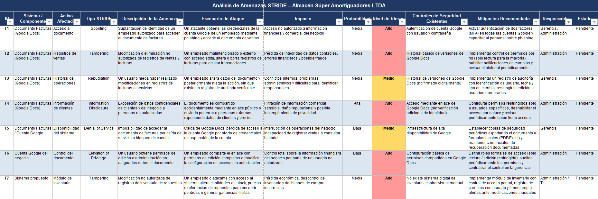
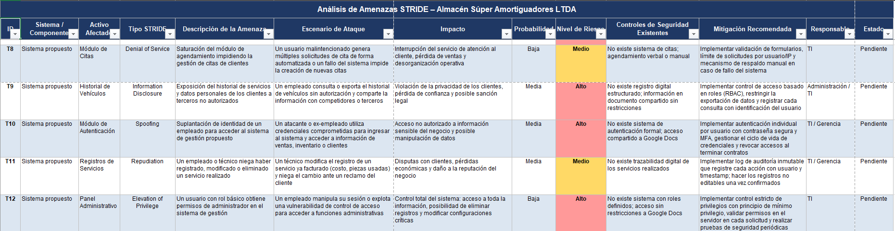

# 📄 Informe Técnico del Taller

## 🔖 Nombre del Taller
_Taller 5 - Evaluación de Seguridad con STRIDE_

## 👥 Integrantes del equipo
- Valentina Ruiz
- Darek Aljuri
- Santiago Soler

## 🧠 Descripción general del trabajo
El objetivo del taller fue aplicar la metodología STRIDE para identificar, describir y clasificar amenazas de seguridad de la información en el contexto real de Almacén Súper Amortiguadores LTDA, un pequeño negocio del sector automotriz que gestiona actualmente su información mediante Google Docs y que está en proceso de diseñar un sistema de gestión digital propio.
La actividad consistió en construir una tabla de análisis de amenazas estructurada, donde cada fila representa una amenaza específica identificada sobre un componente del sistema (actual o propuesto), evaluada según su tipo STRIDE, probabilidad, nivel de riesgo, controles existentes y mitigación recomendada. El resultado es un instrumento de análisis de seguridad concreto y aplicado al negocio, no genérico, que permite priorizar acciones de remediación.

## 🔧 Proceso de desarrollo
El trabajo se estructuró en dos grandes bloques que reflejan el momento tecnológico del negocio: el sistema actual (basado en Google Docs) y el sistema propuesto (en diseño).

Primero se analizó el sistema actual. El punto de partida fue mapear los activos de información existentes: el documento de facturas en Google Docs, la cuenta Google del negocio y los datos de clientes que ahí se almacenan. Con ese inventario claro, se recorrieron las seis categorías STRIDE para preguntar sistemáticamente: ¿qué podría fallar aquí? Esto generó las amenazas T1 a T6.

La decisión de empezar por el sistema actual fue deliberada: es donde el negocio opera hoy, donde el riesgo ya existe y donde no existen controles formales. Comprender ese estado permitió después hacer el análisis del sistema propuesto con mayor rigor, porque ya se tenía claridad sobre qué problemas hereda y cuáles son nuevos.

Luego se analizó el sistema propuesto. Una vez identificados los módulos que conformarán la solución (inventario, citas, historial de vehículos, autenticación, registros de servicios, panel administrativo), se volvió a recorrer STRIDE módulo por módulo, generando las amenazas T7 a T12. Aquí la decisión clave fue no trasladar mecánicamente las mismas amenazas del sistema actual, sino pensar en las amenazas propias de cada módulo nuevo: la saturación del agendamiento (T8) o la escalada de privilegios en el panel administrativo (T12) no existen en el sistema actual porque esas funciones tampoco existen.

Herramientas utilizadas. El análisis se desarrolló directamente en una hoja de cálculo Excel estructurada con 13 columnas, que permite tener toda la información de cada amenaza en un mismo lugar sin fragmentarla. No se utilizaron herramientas automatizadas de escaneo de vulnerabilidades, ya que el sistema propuesto aún no existe como código; el análisis fue completamente conceptual y basado en el conocimiento del negocio, sus procesos y su infraestructura actual.

Criterios de priorización. El nivel de riesgo se asignó combinando dos factores: la probabilidad de ocurrencia (Alta, Media, Baja) y el impacto potencial sobre el negocio. Las amenazas con probabilidad Media o Alta y consecuencias financieras, legales o reputacionales directas recibieron nivel de riesgo Alto. Las de probabilidad Baja pero impacto severo también se clasificaron como Alto, reconociendo que en un negocio pequeño incluso eventos poco frecuentes pueden ser críticos si no hay capacidad de respuesta.

## 🧩 Análisis del modelo propuesto
Estructura del modelo. El modelo entregado tiene 11 amenazas organizadas en dos bloques temáticos dentro de la misma tabla. Cada amenaza se analiza sobre seis dimensiones complementarias: descripción conceptual, escenario concreto de ataque, impacto en el negocio, probabilidad, controles existentes y mitigación recomendada. Esta estructura garantiza que cada amenaza no sea una abstracción genérica, sino algo que el equipo del negocio puede reconocer como un riesgo real de su operación diaria.
El modelo cubre las seis categorías STRIDE de manera equilibrada: dos amenazas de Spoofing (T1, T9), dos de Tampering (T2, T7), dos de Repudiation (T3, T10), dos de Information Disclosure (T4, T8), dos de Denial of Service (T5) y dos de Elevation of Privilege (T6, T11). Esta distribución simétrica no fue aleatoria: refleja que cada categoría de amenaza aplica al sistema actual, aunque con manifestaciones distintas.
Cómo representa las necesidades del cliente. El modelo fue construido con el negocio en mente en todo momento. Las amenazas no son formulaciones técnicas abstractas, sino situaciones que el dueño o un empleado del almacén puede leer y entender: "un empleado modifica facturas y niega haberlo hecho" (T3), "el documento se comparte accidentalmente por enlace público exponiendo la cédula de los clientes" (T4), "un ex-empleado usa sus credenciales para acceder al sistema después de salir" (T9). Esta concreción responde a una necesidad real: en una empresa de 7 personas sin equipo de TI propio, el análisis de seguridad solo es útil si quienes deben actuar sobre él lo comprenden sin intermediación técnica.
Las mitigaciones recomendadas también respetan las limitaciones del negocio. No se proponen soluciones empresariales costosas, sino controles proporcionales: activar MFA en Google, hacer exportaciones semanales del documento, definir roles de acceso. El responsable asignado a cada amenaza (Gerencia, Administración o TI) reconoce que en este negocio no existe un área de seguridad dedicada.
Supuestos del modelo. El análisis parte de varios supuestos explícitos e implícitos. El primero es que el sistema actual tendria al menos los cinto módulos identificados (inventario, historial de vehículos, autenticación, registros de servicios, panel administrativo) y que operará sobre algún entorno web o de aplicación, aunque la arquitectura técnica específica aún no está definida. El segundo supuesto es que el negocio mantiene su escala actual de aproximadamente 7 empleados, lo que influye en la probabilidad asignada a ciertos escenarios de ataque interno: en equipos pequeños, la confianza entre empleados es alta pero el control formal es bajo. Finalmente, se asume que todos los estados están marcados como "Pendiente" porque el sistema propuesto aún no existe, lo que significa que ninguna mitigación ha sido implementada todavía y el modelo funciona como hoja de ruta, no como auditoría de controles existentes.

## 📈 Diagrama final entregado

## 📋 Tabla de actores, entidades o componentes (si aplica)

| Nombre del elemento | Tipo | Descripción | Responsable |
|---------------------|------|-------------|-------------|
| Ej: Paciente        | Actor | Usuario que agenda una cita médica | Cliente |

## 🔍 Investigación complementaria
### Tema investigado:
(Ej: Buenas prácticas BPMN, comparación TOGAF vs C4, principios de seguridad STRIDE, etc.)

### Resumen:
El modelo STRIDE es una metodología de modelado de amenazas utilizada en seguridad informática para identificar posibles vulnerabilidades en sistemas de software durante las etapas de diseño y arquitectura. Este modelo fue desarrollado por Microsoft como parte de su proceso de desarrollo seguro y clasifica las amenazas en seis categorías principales: Spoofing (suplantación de identidad), Tampering (manipulación de datos), Repudiation (repudio de acciones), Information Disclosure (divulgación de información), Denial of Service (denegación de servicio) y Elevation of Privilege (elevación de privilegios). Estas categorías permiten analizar sistemáticamente los componentes de un sistema y detectar posibles riesgos de seguridad antes de que el sistema sea implementado o desplegado.

El modelado de amenazas con STRIDE suele aplicarse sobre diagramas de arquitectura o diagramas de flujo de datos, analizando cada componente del sistema y las interacciones entre ellos para identificar qué tipo de amenaza podría afectar a cada elemento. De acuerdo con la documentación oficial de Microsoft y diversos estudios sobre seguridad de software, esta metodología ayuda a anticipar vulnerabilidades, mejorar el diseño del sistema y definir controles de seguridad adecuados desde etapas tempranas del desarrollo. Entre las buenas prácticas se encuentra analizar cada componente del sistema, identificar las posibles amenazas asociadas y posteriormente definir mecanismos de mitigación que reduzcan el riesgo de ataques.

En el contexto del taller, esta investigación se relaciona directamente con el análisis de seguridad realizado sobre el sistema modelado previamente mediante diagramas de arquitectura. A partir del diagrama de infraestructura y de los componentes del sistema, el equipo aplicó el modelo STRIDE para identificar posibles amenazas de seguridad en cada elemento del sistema, como riesgos de acceso no autorizado, manipulación de información o interrupción del servicio. De esta forma, el ejercicio permitió comprender cómo el modelado de amenazas puede utilizarse para evaluar la seguridad de una arquitectura tecnológica y detectar vulnerabilidades antes de implementar una solución tecnológica.

## 📚 Referencias
- Microsoft Learn. (2023). Threat modeling with STRIDE.
Disponible en: https://learn.microsoft.com/en-us/security/engineering/threat-modeling-stride

- OWASP. (2023). Threat Modeling.
Disponible en: https://owasp.org/www-community/Threat_Modeling

- Carnegie Mellon Software Engineering Institute. (2022). Threat Modeling and STRIDE methodology.
Disponible en: https://insights.sei.cmu.edu/blog/threat-modeling-what-it-is-and-how-to-use-it/

- Threat Modeling: Designing for Security. Shostack, A. (2014). Wiley.

---

_Este documento hace parte de la entrega del taller 5 del curso AREM (Arquitectura Empresarial) - Universidad de La Sabana._
